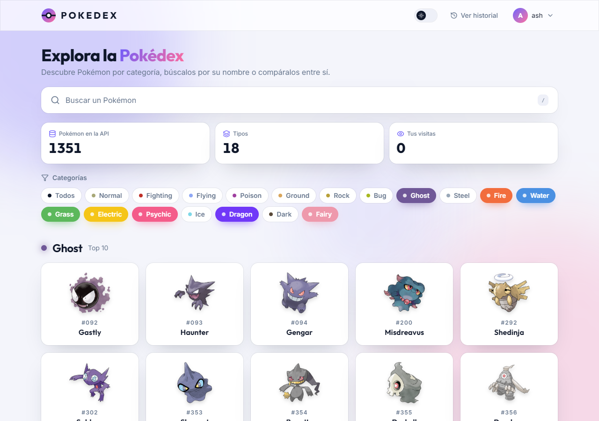
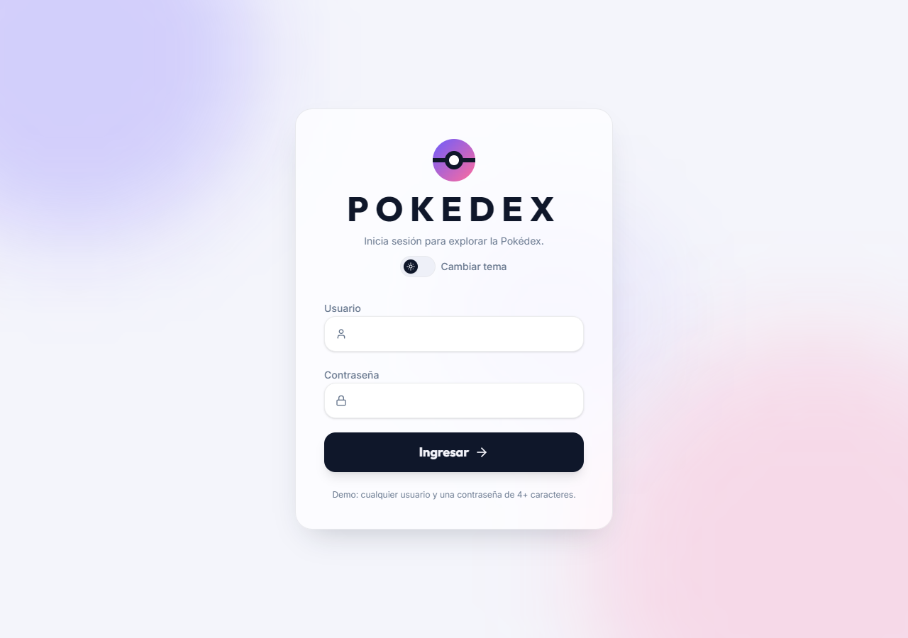
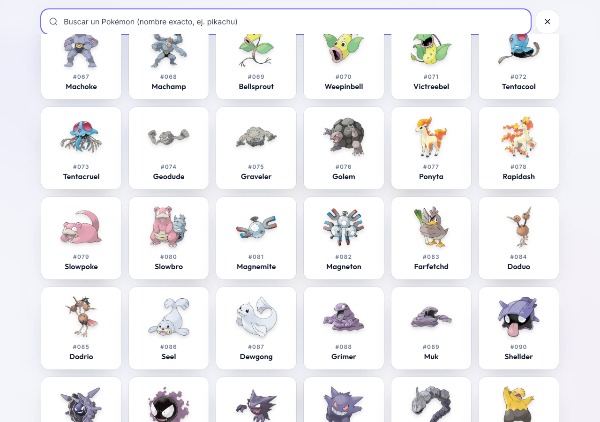
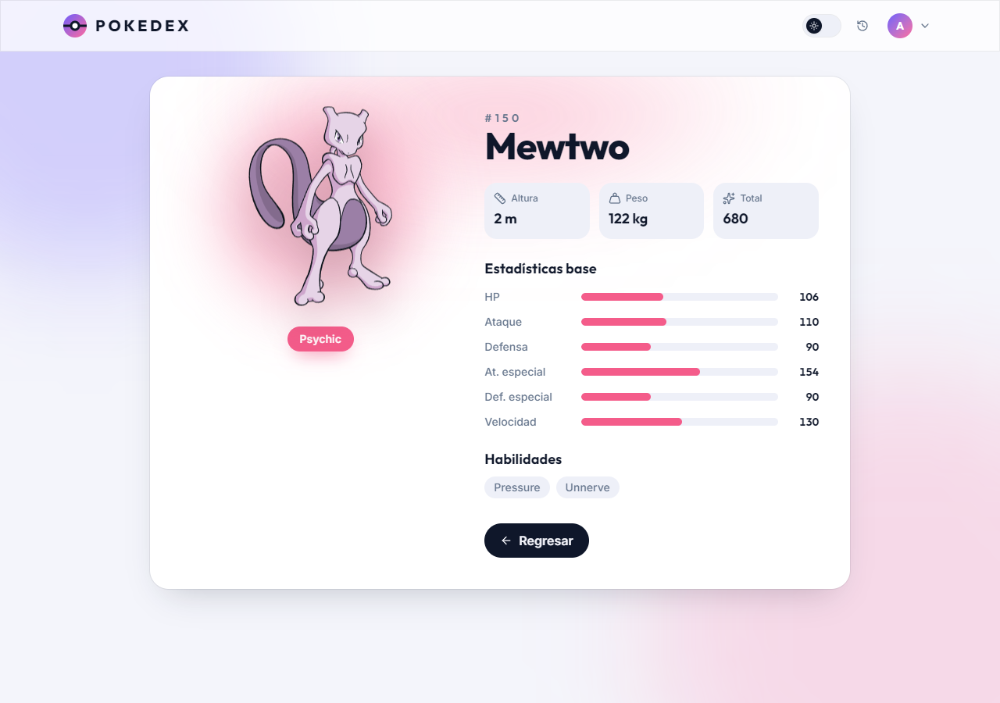
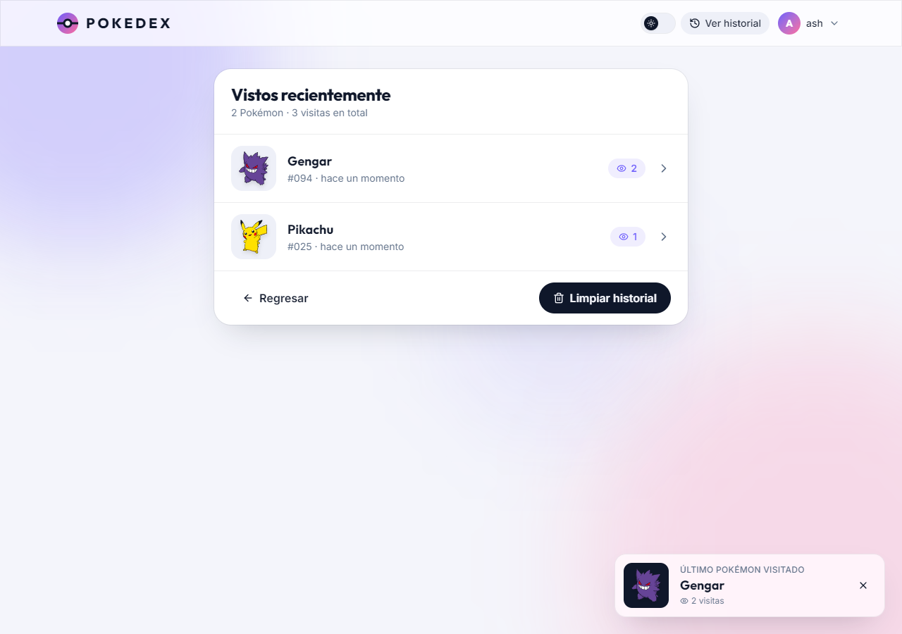
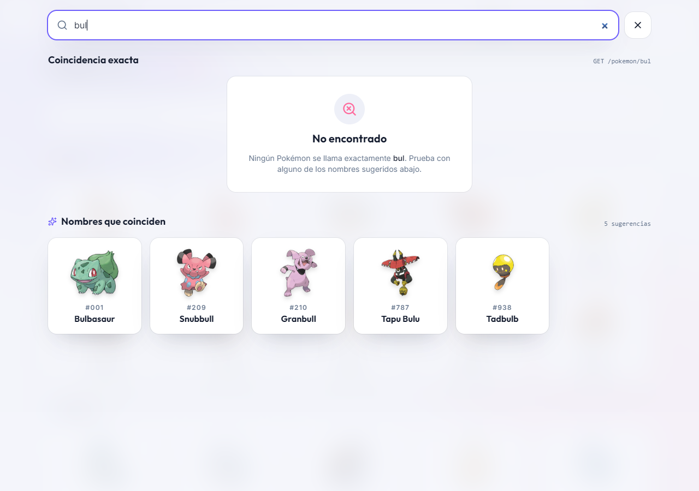
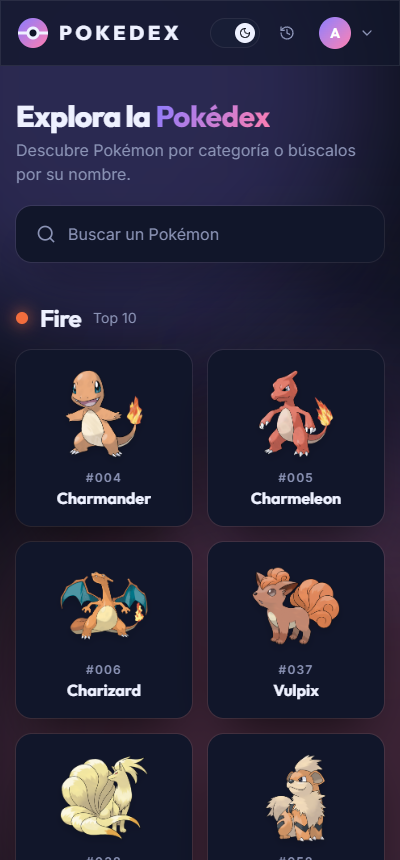
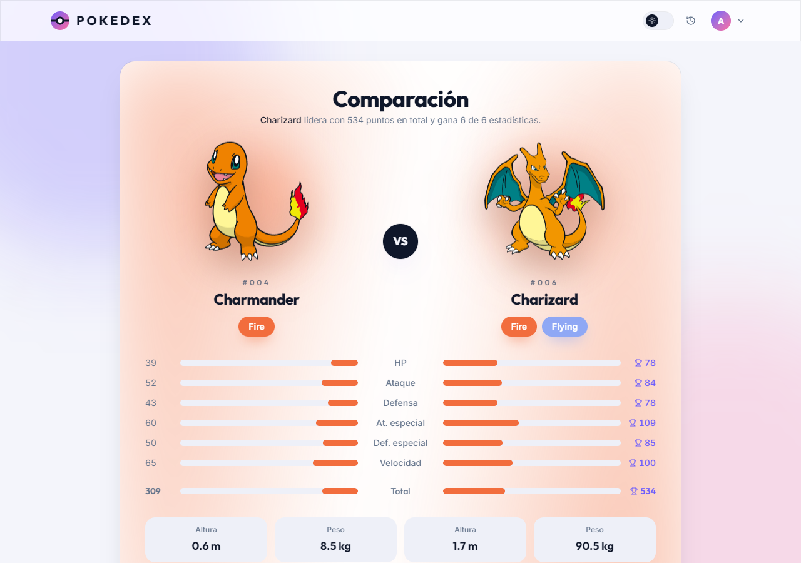
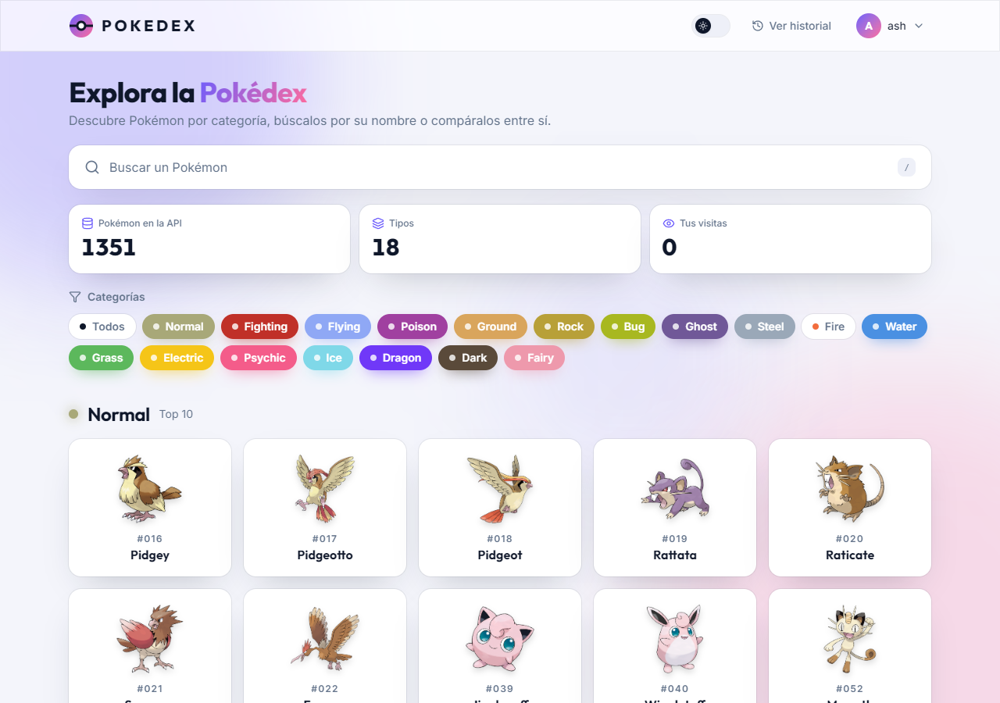

# Pokédex con Microfrontends

Reto técnico frontend: una Pokédex construida con **React 19 + Vite + Module Federation**, dividida en un shell y dos microfrontends que se integran en tiempo de ejecución.

| App                      | Puerto | Responsabilidad                                                                  |
| ------------------------ | ------ | -------------------------------------------------------------------------------- |
| `shell` (host)           | `3000` | Login, layout, navegación, home por categorías, buscador fullscreen, tema, toast |
| `pokemon-detail` (MF 1)  | `3001` | Detalle del Pokémon (imagen SVG, tipos, stats, habilidades)                      |
| `pokemon-history` (MF 2) | `3002` | Historial de Pokémon visitados con conteo de visitas y persistencia              |

**Demo:** <https://cesarpina.github.io/pokedex-microfrontends/> (las tres apps publicadas en GitHub Pages).



<details>
<summary>Más capturas</summary>

|                        Login                         |         Buscador (modal fullscreen)          |
| :--------------------------------------------------: | :------------------------------------------: |
|                  |    |
|                  **Detalle (MF 1)**                  |         **Historial (MF 2) + toast**         |
|              |  |
|              **Búsqueda sin resultado**              |           **Mobile, tema oscuro**            |
|  |   |
|                **Comparador (MF 1)**                 |             **Filtros por tipo**             |
|        |      |

</details>

## Funcionalidades

- **Login** con sesión persistida y rutas protegidas.
- **Home** con estadísticas reales de la API (cuántos Pokémon y tipos existen), filtros por tipo y listado de 10 Pokémon por categoría.
- **Buscador** en modal fullscreen: 30 Pokémon iniciales con scroll infinito, búsqueda por nombre exacto y sugerencias por fragmento.
- **Detalle** (microfrontend 1): imagen SVG, tipos, estadísticas animadas, habilidades, altura y peso.
- **Comparador** (microfrontend 1): se eligen dos Pokémon desde cualquier tarjeta o desde el detalle y se comparan estadística por estadística.
- **Historial** (microfrontend 2): Pokémon visitados con conteo de visitas, persistente entre recargas.
- **Toast** al recargar con el último Pokémon visitado.
- **Tema claro / oscuro**, diseño responsive y estados de carga, error y vacío en cada bloque.

## Requisitos

- Node.js 20 o superior (desarrollado con la 22).
- pnpm 10. Si no lo tienes: `corepack enable` lo activa usando la versión fijada en `packageManager`.
- Los puertos `3000`, `3001` y `3002` libres.

## Instalación

```bash
git clone https://github.com/cesarpina/pokedex-microfrontends.git
cd pokedex-microfrontends
pnpm install
```

## Cómo levantar el proyecto

### Desarrollo (las tres apps a la vez)

```bash
pnpm dev
```

Abre <http://localhost:3000>. El shell consume los `remoteEntry.js` de `3001` y `3002`, por lo que los tres servidores deben estar arriba. Cualquier usuario con una contraseña de al menos 4 caracteres inicia sesión (no hay backend de autenticación, la sesión se guarda en `localStorage`).

Cada microfrontend también se puede abrir de forma independiente para desarrollarlo aislado:

- <http://localhost:3001/?name=charizard> — detalle (el parámetro `name` es opcional).
- <http://localhost:3002> — historial.

### Levantar solo una app

```bash
pnpm --filter @pokedex/shell dev
pnpm --filter @pokedex/pokemon-detail dev
pnpm --filter @pokedex/pokemon-history dev
```

### Build y vista previa de producción

```bash
pnpm build     # compila las tres apps en apps/*/dist
pnpm preview   # sirve los builds en los mismos puertos (3000, 3001, 3002)
```

Si los remotos se despliegan en otro dominio o bajo un subdirectorio, el shell lee sus URLs de variables de entorno y las tres apps aceptan `VITE_BASE_PATH` (ver `apps/shell/.env.example`):

```
VITE_POKEMON_DETAIL_URL=https://detail.midominio.com
VITE_POKEMON_HISTORY_URL=https://history.midominio.com
```

### Despliegue

El workflow `.github/workflows/deploy.yml` publica la demo en GitHub Pages en cada push a `main`: construye los dos microfrontends con `VITE_BASE_PATH` bajo `/detail/` y `/history/`, construye el shell apuntando a esas URLs, junta los tres `dist` en una sola carpeta y copia `index.html` como `404.html` para que las rutas del SPA funcionen al recargar.

## Scripts

| Script           | Qué hace                                             |
| ---------------- | ---------------------------------------------------- |
| `pnpm dev`       | Levanta shell + microfrontends en paralelo           |
| `pnpm build`     | Build de producción de las tres apps                 |
| `pnpm preview`   | Sirve los builds en los puertos 3000/3001/3002       |
| `pnpm test`      | Tests unitarios (Vitest) del paquete compartido      |
| `pnpm typecheck` | `tsc` en todos los paquetes                          |
| `pnpm lint`      | ESLint (reglas de TypeScript, hooks y react-refresh) |
| `pnpm format`    | Prettier sobre todo el repo                          |

## Stack

- **React 19** con **Vite 7** y **`@module-federation/vite`** (Module Federation 2.0).
- **Zustand** para estado (sesión, tema, historial, estado del buscador).
- **TanStack Query** para data fetching contra PokeAPI (caché, reintentos, `useInfiniteQuery` para el scroll infinito).
- **Tailwind CSS v4** con tokens de diseño propios y **Motion** para las animaciones.
- **TypeScript** estricto, ESLint, Prettier y Vitest.
- Monorepo con **pnpm workspaces**.

## Estructura del repositorio

```
apps/
  shell/              host · login, home, buscador, layout, tema, toast, carga de remotos
  pokemon-detail/     microfrontend 1 · expone ./PokemonDetail
  pokemon-history/    microfrontend 2 · expone ./PokemonHistory
packages/
  shared/             @pokedex/shared · cliente PokeAPI, hooks de query, stores, tokens de estilo
tools/
  federation.ts       dependencias compartidas y puertos, usados por los tres vite.config
```

Dentro de cada app el código se organiza por feature (`features/auth`, `features/search`, `features/home`...) con componentes de UI genéricos en `components/` y hooks reutilizables en `hooks/`.

## Decisiones técnicas

### Integración entre shell y microfrontends

- El shell carga cada remoto con `React.lazy` envuelto en un `RemoteModule` que combina `Suspense` (skeleton mientras llega el bundle) y un error boundary con botón de reintento. Si un remoto está caído, el resto de la app sigue funcionando.
- Los remotos reciben solo props (`name`, `onBack`, `onSelect`) y no conocen el router del shell. Los contratos de props viven en `packages/shared/src/contracts.ts`, así shell y remotos comparten el mismo tipo y el `remotes.d.ts` del shell queda tipado.
- `react`, `react-dom`, `@tanstack/react-query`, `zustand` y `@pokedex/shared` se declaran como **singletons** en la federación. Es lo que permite que el `QueryClientProvider` del shell sirva a los remotos y que los stores de Zustand sean una única instancia en toda la página.
- Los estilos de cada remoto viajan con el módulo expuesto (importa `remote.css`: tema + utilidades, sin preflight). El shell aporta el reset y los estilos base una sola vez. Los tokens de color, tipografía y animaciones son compartidos, así que los tres se ven como una sola aplicación y responden al mismo cambio de tema.

### Paquete `@pokedex/shared`

Concentra lo que de otro modo se duplicaría en las tres apps: el cliente HTTP con `ApiError`, los mapeos de PokeAPI a modelos de dominio (`PokemonSummary`, `PokemonDetail`), los hooks de TanStack Query con sus `queryKeys`, los stores de historial y tema, y los tokens CSS. Se consume como código fuente TypeScript (sin paso de build) y se comparte como singleton en Module Federation.

### Estrategia de historial

El store (`packages/shared/src/history/store.ts`) usa Zustand con el middleware `persist` sobre `localStorage`, bajo la clave `pokedex.history`. La estructura persistida es:

```ts
{
  entries: Array<{ id: number; name: string; image: string; visits: number; lastVisitedAt: number }>
  lastVisit: { name: string; sequence: number } | null
  dismissedSequence: number | null
}
```

- **Registro**: el microfrontend de detalle llama a `recordVisit` cuando el Pokémon termina de cargar (no antes, para no guardar visitas a nombres inexistentes). Un `ref` evita el doble registro que provoca `StrictMode` en desarrollo.
- **Sin duplicados**: la entrada se identifica por `name`. Si ya existe, se incrementa `visits` y se mueve al inicio de la lista; si no, se crea con `visits: 1`. La lista queda ordenada por visita más reciente.
- **Persistencia**: al ser el mismo store singleton, el shell (toast), el detalle (escritura) y el historial (lectura) ven el mismo estado en memoria y en `localStorage`, sin eventos ni sincronización manual.
- Las reglas están cubiertas por tests unitarios (`pnpm test`).

### Toast al recargar

Cada visita incrementa `lastVisit.sequence`. Al cerrar el toast se guarda `dismissedSequence = lastVisit.sequence`. Al montar el shell se calcula una sola vez si hay un toast pendiente (`lastVisit` existe y su `sequence` es distinto del descartado). Así:

- Si el usuario cierra el toast y recarga, no vuelve a aparecer.
- Si visita otro Pokémon (o el mismo) y recarga, aparece de nuevo.
- Navegar dentro de la app no lo dispara, solo la recarga.

Elegí un contador en lugar de un timestamp porque dos visitas dentro del mismo milisegundo colisionarían; el test _shows the toast again after a new visit_ lo cubre.

### Buscador

- La lista inicial usa `useInfiniteQuery` con `limit=30` y `offset += 30`. Un sentinel con `IntersectionObserver` (con el contenedor scrollable del modal como `root`) pide la siguiente página 400 px antes de llegar al final.
- La búsqueda es por nombre exacto contra `GET /pokemon/{name}`, como pide el enunciado. El término se normaliza (minúsculas, sin acentos ni espacios) y se aplica _debounce_ de 350 ms. Un 404 se traduce al estado "No encontrado"; otros errores muestran un mensaje con reintento y no se reintenta un 404.
- Como nadie recuerda el nombre completo de 1300 Pokémon, debajo del resultado exacto muestro **sugerencias por fragmento** calculadas en el cliente: la primera vez que se escribe algo se descarga el índice de nombres (`GET /pokemon?limit=2000`, unos 100 KB, cacheado con `staleTime: Infinity`) y se filtra en memoria priorizando los nombres que empiezan por el término. Escribir `bul` muestra "No encontrado" en la coincidencia exacta y Bulbasaur como sugerencia, sin ninguna petición extra por tecla.
- El modal es fullscreen, bloquea el scroll del body, se abre con `/` y se cierra con `Esc`.

### Home

Al entrar se consulta `GET /pokemon?limit=1` (para el total de Pokémon) y `GET /type` (para la lista de tipos, descartando los que la API marca como desconocidos). Con eso se pintan las estadísticas de cabecera y los chips de filtro. Por defecto están activos ocho tipos (`fire`, `water`, `grass`...) y cada uno muestra los 10 primeros Pokémon de `GET /type/{type}`; el usuario puede activar o quitar cualquiera de los 18. Las categorías fuera del viewport se cargan al acercarse (lazy con `IntersectionObserver`) para no lanzar todas las peticiones de golpe, y cada sección maneja sus propios estados de carga, error y reintento.

### Comparador

Cada tarjeta y el detalle tienen un botón para añadir el Pokémon a la comparación. La selección vive en un store de Zustand (`pokedex.compare`, máximo dos, el más antiguo se descarta al elegir un tercero) que comparten shell y microfrontends. Mientras haya algo seleccionado, el shell muestra una bandeja flotante con los dos huecos y el botón "Comparar", que navega a `/compare/:a/:b`. La vista de comparación la expone el microfrontend de detalle como segundo módulo federado (`./PokemonCompare`) porque reutiliza sus componentes de imagen, tipos y barras; recibe los dos nombres por props y reutiliza las mismas queries cacheadas del detalle.

### Imágenes

Para las tarjetas se usa el _official artwork_ (PNG con fondo transparente) construido a partir del `id`, que se extrae de la URL del recurso. En el detalle se prefiere el SVG de `dream_world` y se cae a `official-artwork` o al sprite por defecto si no existe.

### Tema claro / oscuro

El tema se guarda en `localStorage` y se aplica como `data-theme` en `<html>`. Los tokens CSS (`--canvas`, `--surface`, `--ink`, `--accent`...) cambian con ese atributo y Tailwind los expone como utilidades (`bg-surface`, `text-muted`) mediante `@theme inline`. El valor inicial respeta `prefers-color-scheme`.

### Sesión

Sin backend, cualquier usuario con contraseña de 4+ caracteres entra. El store `pokedex.session` persiste al usuario, `RequireAuth` protege las rutas y el menú del usuario permite cerrar sesión.

## Lo que haría a continuación

- Tests de componentes con Testing Library para el buscador y el toast, y un flujo end-to-end con Playwright.
- Un manifiesto de remotos servido por configuración para poder cambiar la URL de un microfrontend sin rebuild del shell.
- Comparar más de dos Pokémon y añadir la tabla de efectividad de tipos (`damage_relations`).
- Prefetch del detalle al hacer _hover_ sobre una tarjeta.

## Licencia

MIT
